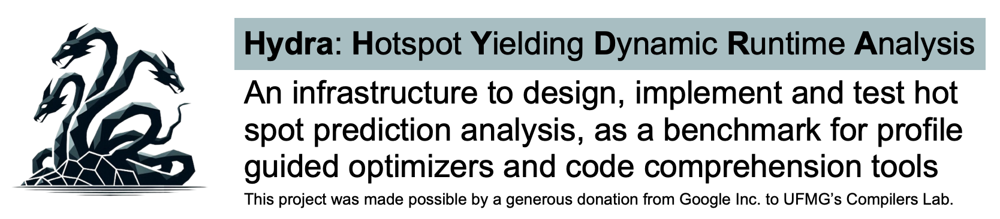

<p align="center">
  </br>
</p>

Hydra is a collection of benchmarks and tools to test the ability of different techniques to predict the hottest spot in programs.
Each benchmark consits of a single compilable C file that runs with one or more different inputs.
We provide execution counts for all the edges of each program, a [table](https://docs.google.com/spreadsheets/d/18C-DGg_l2gepRRfea_ivrW1o9qUde5fHHr6g3LIGn_I/edit?usp=sharing) that we call "*the Ground Truth*", plus scripts to extract and display these counts.

## Build

```bash
cmake -S . -B build -DLLVM_INSTALL_DIR=/usr/lib/llvm-20
cmake --build build -j$(nproc)
```

Requires CMake ≥ 3.20 and LLVM ≥ 17.

## Projection pipeline

Collect profiles at -O0, project them onto the -O3 CFG via block hash matching, then inject
and compile — no second profiling run needed.

```bash
# 1. Normalized O0 IR
clang -O0 -Xclang -disable-O0-optnone -emit-llvm -S src.c -o src.ll
opt -S -passes="mem2reg,instnamer,loop-simplify,break-crit-edges" src.ll -o o0_norm.ll

# 2. Instrument, run, extract edge profiles
opt -passes="pgo-instr-gen,instrprof" o0_norm.ll -o inst.bc
clang -fprofile-instr-generate inst.bc -o program
LLVM_PROFILE_FILE=bench.profraw ./program
llvm-profdata merge bench.profraw -o bench.profdata
opt -S -passes="pgo-instr-use" --pgo-test-profile-file=bench.profdata o0_norm.ll -o annotated.ll
build/bin/profdata2Edges annotated.ll o0_profiles/

# 3. Normalized O3 IR, then project O0 profiles onto it
clang -O3 -emit-llvm -S src.c -o src_o3.ll
opt -S -passes="mem2reg,instnamer,loop-simplify,break-crit-edges" src_o3.ll -o o3_norm.ll
opt -disable-output \
    -load-pass-plugin=build/lib/libBlockOrderingHashMatching.so \
    -passes="block-ordering-hash-matching" \
    o3_norm.ll -prog o0_norm.ll -prof o0_profiles/ -proj-out projected/ \
    -matching-threshold 25

# 4. Inject projected profiles and compile
opt -load-pass-plugin=build/lib/libHydraProfileInject.so \
    -passes="hydra-inject=projected/,default<O3>" \
    o3_norm.ll -o optimized.bc
clang -O3 optimized.bc -o program_optimized
```

`run_cbench_pgo.sh` automates this over 32 cBench benchmarks and prints a six-pipeline
comparison table (O0 reference, per-TU O3, per-TU PGO, whole-module O3, whole-module PGO
oracle, Hydra projected).

```bash
# optional overrides
LLVM_BIN=/path/to/llvm/bin  RUNS=5  bash run_cbench_pgo.sh
```

Results go to `cbench_pgo_results/results.csv`.

The pipeline above uses LLVM's built-in `pgo-instr-gen`/`pgo-instr-use` instrumentation,
which removes the dependency on an external profiler. If you have a
[Nisse](https://github.com/lac-dcc/Nisse) build, its `.prof.full.edges` output is fully
compatible — point `-prof` at Nisse's output directory and skip steps 2–3.

The pipeline above uses LLVM's built-in `pgo-instr-gen`/`pgo-instr-use` instrumentation to
collect profiles, which removes the dependency on an external profiler. If you have a
[Nisse](https://github.com/lac-dcc/Nisse) build, its `.prof.full.edges` output is fully
compatible — point `-prof` at Nisse's output directory and skip steps 2–3.

## Tools

### profdata2Edges

Reads a PGO-annotated IR file (output of `pgo-instr-use`) and writes one `.prof.full.edges`
file per function:

```
entry: 10000
bb -> bb1 : 9000
bb -> bb2 : 1000
```

```bash
build/bin/profdata2Edges annotated.ll output_dir/
```

### HydraProfileInject

LLVM opt pass. Reads `.prof.full.edges` files and injects `!prof branch_weights` and
`function_entry_count` metadata into the IR.

```bash
opt -load-pass-plugin=build/lib/libHydraProfileInject.so \
    -passes="hydra-inject=projected/,default<O3>" \
    o3_norm.ll -o optimized.bc
```

### hydra2profdata

Converts `.prof.full.edges` files to LLVM `.profdata`. Useful for coverage workflows;
for PGO optimization use `HydraProfileInject` directly.

```bash
build/bin/hydra2profdata program.ll profiles/ output.profdata
```

Requires IR compiled with `pgo-instr-gen` (needs `__profd_` globals present in the IR).

## How to produce the ground truth (using Nisse profiler)

You can regenerate the ground truth (in [JSON](./JSON%20Files/jotaiMerlinResults.json)) running the script [nisse_all.sh](./Benchmark%20Scripts/Jotai/nisse_all.sh). The following dependencies are required:

- Clang 17 or newer
- A build of the [Nisse profiler](https://github.com/lac-dcc/Nisse)

Now, you need to adjust some parameters that suit your environment:

- In the [config.sh](./Benchmark%20Scripts/config.sh) configuration file:
  - `LLVM_INSTALL_DIR` (line 3): must point to your LLVM installation directory
  - `NISSE_SOURCE_DIR` (line 4): must point to your NISSE source directory
  - `NISSE_BUILD_DIR` (line 5): must point to your NISSE build directory
- In the [nisse_all.sh](./Benchmark%20Scripts/Jotai/nisse_all.sh) script:
  - `BASE_DIR` (line 3): must point to your hydra (this repository) source directory

With these configurations correctly set, running the script `nisse_all.sh` must generate a file named `jotaiMerlinResults2.json` in the folder `JSON_Files`. You can compare it with the `jotaiMerlinResults.json` using `diff`.

## How to get the heuristics results

There are three heuristics (two of which are trivial) implemented to guess the hottest blocks, which are:

- **Random block**: a random block from the program is considered the hottest block
- **Most nested block**: a random most nested loop header from the program is considered the hottest block
- **LLVM-Predictor**: the LLVM analyzes `LoopInfo` and `BranchProbabilityInfo` are used to predict the frequency of each basic block, considering the entry block executes only once. The block with the highest estimated frequency is considered the hottest block

In order to run them, you must have the following requirements:

- CMake version 3.20 or newer
- Clang version 17 or newer

Also, there are some parameters to adjust:

- In the [build.sh](./build.sh) script:
  - `LLVM_INSTALL_DIR` (line 3): must point to your LLVM installation directory
- In the [run.sh](./run.sh) script:
  - `LLVM_INSTALL_DIR` (line 3): must point to your LLVM installation directory
  - `BASE_DIR` (line 4): must point to your hydra (this repository) source directory

With these configurations correctly set, you must run the scripts `build.sh` and `run.sh` in this order, and it must generate the JSONs `jotaiRandomBlock2.json`, `jotaiNestedBlock2.json` and `jotaiPredictorBlock2.json` in the folder `JSON_Files`. Also, they can be compared with their respective original files using `diff`.

## How to get the CSV table

With the `jotaiMerlinResults.json`, `jotaiRandomBlock.json`, `jotaiNestedBlock.json` and `jotaiPredictorBlock.json` files, you can generate a CSV file containing the detailed results by executing the `genCsv.py` python script.

## How to pretty print a JSON file

The script `print_jotai_json.py` receives a path to the JSON file as parameter and returns a pretty print of this file. For more options, run `python3 print_jotai_json.py --help`.

The output format is as follows:

Each file in the benchmark begins with its name, followed by a line with the number of executions of this file.

Then, for each execution, the following structure appears:

1. A line indicating the number of edges, denoted as `N`
2. `N` subsequent lines, each containing information about an edge. The format of each line is:
   - `u` -> `v` : `count`
   - Here, `u` and `v` represent the origin and destination blocks of the edge, respectively
   - `count` represents the number of times this edge is traversed during the execution.

There are also two other scripts in Python that are similar to `print_jotai_json.py`:

- The script `get_block_frequencies.py` takes the JSON input and compute the block frequencies based on the edges frequencies. The output is very similar to the `print_jotai_json.py` one, but for each block the output is only `u` : `count`. The critical edges blocks are omitted in the output.
- The script `get_hottest_block.py` not only compute the frequencies, but also compute what is the hottest blocks among every block in one execution. The output of one execution is a line, indicating the number `N` of hot blocks, followed by `N` lines, each one containing an ID of a hot block in that execution.
